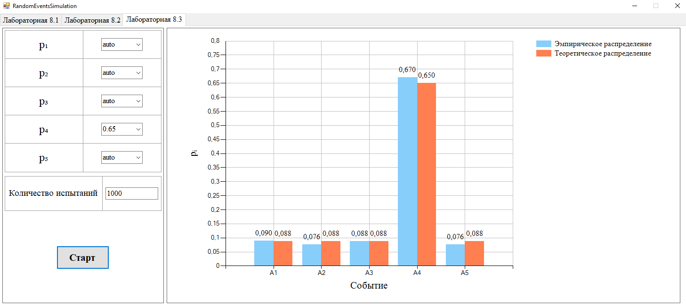

# 🎲 RandomEventsSimulation

Simulation of **random events** using probability theory methods in WinForms.  
Симуляция **случайных событий** с применением методов теории вероятностей в WinForms.

---

## 📌 About / О проекте

🎓 Developed for coursework on probability and random processes.  
💡 Demonstrates experiments with random outcomes, uniform distributions, and simulation statistics.  
🖱 Provides interactive forms with charts and visual feedback.

🎓 Разработано в рамках лабораторной работы по теории вероятностей и случайным процессам.  
💡 Демонстрирует эксперименты со случайными исходами, равномерными распределениями и статистикой моделирования.  
🖱 Включает интерактивные формы с графиками и визуальной обратной связью.

---

## 🔧 Features / Возможности

### Lab 8.1 — **Binary Random Event / Двоичное случайное событие**
- ✅ Simple "Yes/No" experiment with probability `P(A)=0.5`  
  Простейший эксперимент "Да/Нет" с вероятностью `P(A)=0.5`
- 🎨 Visual feedback with color-coded label  
  Цветовая индикация результата

### Lab 8.2 — **Magic 8-Ball Simulation / Симуляция «Шар судьбы»**
- 🔮 20 possible responses (positive, neutral, negative)  
  20 возможных ответов (положительные, нейтральные, отрицательные)
- 🎲 Equal probabilities for all outcomes  
  Равновероятное распределение исходов
- 🖱 Interactive click to generate prediction  
  Щелчок по надписи для генерации ответа

### Lab 8.3 — **Discrete Distribution Simulation / Симуляция дискретного распределения**
- ⚖ User-defined probabilities for 5 events (`A1..A5`)  
  Пользователь задаёт вероятности для 5 событий (`A1..A5`)
- 🤖 Support for `"auto"` fields to balance probabilities automatically  
  Поддержка полей `"auto"` для автоматического распределения вероятностей
- 📊 Monte Carlo simulation with configurable number of trials  
  Моделирование методом Монте-Карло с задаваемым числом испытаний
- 📈 Side-by-side comparison of **theoretical vs empirical frequencies**  
  Сравнение **теоретических и эмпирических частот** на диаграмме

---

## 📁 Structure / Структура

- `Form_Main.cs` — main form with TabControl switching between labs  
  Основная форма с вкладками для переключения между лабораторными
- `UserControl_Lab8_1.cs` — binary random event simulation  
  Симуляция двоичного случайного события
- `UserControl_Lab8_2.cs` — Magic 8-ball with 20 random responses  
  «Шар судьбы» с 20 случайными ответами
- `UserControl_Lab8_3.cs` — discrete distribution experiment with chart visualization  
  Эксперимент с дискретным распределением и визуализацией на графике

---

## 🖼 Screenshots / Скриншоты

  
*Рис. 1 — Главное окно программы*

---
